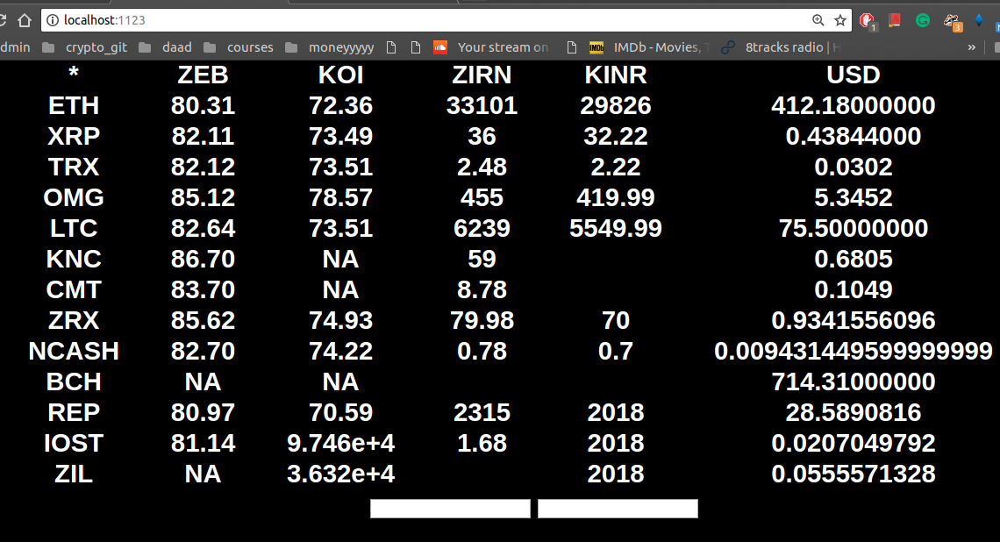

# freedom-forex
Dec 18,  UPDATE: moved to aws Lambda, [Live Link](https://agwi2ny3q9.execute-api.us-east-1.amazonaws.com/dev/users/create). ( Koinex and BitBns )

:warning:UPDATE: Since 6 July due to RBI regulations Kionex and Zebpay has stopped withdrawals so the INR you see in their apps may not translate to money in your bank. Contact respective exchanges more details.

One of the few functional use-cases of crypto is cross-currency transfers. The volatile nature of cryptos often cause this exchange rates to deviate drastically from the bank rates. This app calculates this rate by comparing the INR rates of many cryptos on the exchanges Zebpay and Koinex with their respective USD rates on Binance and OkEx.

:warning: Please do not attempt to try international transfers without understanding the risks involved or making sure that you comply with all applicable jurisdictions

## Getting started 
To run this app you need Node.js, you can get it [here](https://nodejs.org/en/download/ "node's Homepage").
Once that is taken care of clone this repository, cd into it, and install dependencies with npm
```
git clone https://github.com/praneethmendu/freedom-forex.git
cd freedom-forex
npm i
```
## Running the app
When in the app folder, start the app with
```
node server
```
Then go to http://localhost:7777 from your browser

## preview


